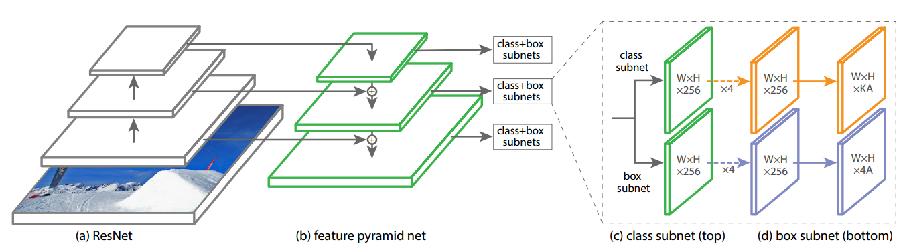

# Focal Loss for Dense Object Detection
## RetinaNet implemented by tensorflow 2.2
**You can use this algorithm to do your own projects that need object detection, just try it! And it is convenient for me to use eager tensorflow because eager mode makes me debug efficiently.**

___

### content
1. Environment
2. How to Train
3. Contribution of Focal Loss
4. ToDO

### Environment
tensorflow2.2 & python3.7
___

### How to Train
1. Firstly, you need to generate VOC format dataset, then you can train your own dataset.
2. Modify config.py and set the params according to your requirements.
```
   python train.py
```

___

### Contribution of Focal Loss

* A New Architecture
<p></p>

**Backbone[Resnet]**
**Neck[FPN]**: use FPN to fuse high level feature and low level feature together, so, the low level feature can more rich. But, low level feature have important information too. So, i will use PANet to implement biFPN and augment high level feature.
**Head[Subnet]**:the subnet is composed with classification subnet and box regression subnet. Use four conv layers with only 3*3 filters and two subnets don't share parameters each other. **Authors find that these high-level architecture to be more important than specific values of hyperparameters.** 

* Focal Loss

  <p></p>

  This is a common problem that background is overwhelming foreground and much of background is easy negative. The easy negatives can overwhelm losses and lead to **degenerate model**.
  Focal loss can eliminate class imbalance  by down-weighting easy targets.
  **Alpha is 0.25 and gamma is 2 are best in experiments.**


* Bias Initializer
  <p></p>
  If we initialize bias to be zero, after sigmoid operation the probability will be 0.5
  The negative loss will be very big after computing loss with binary crossentropy.
  So, authors propose a novel initializing method that force initial probability be π.
___

### ToDO
- [x] data augment
- [x] focal loss
- [x] smooth l1 loss
- [x] bias initializer
- [x] subnet
- [x] anchors target(do not need to sample anchors because we use focal loss)
- [x] diary logger
- [ ] consine anneal
- [ ] step decay
- [ ] polynomial decay
- [ ] exponential decay
- [ ] cutmix aug
- [ ] mixup aug
- [ ] panet